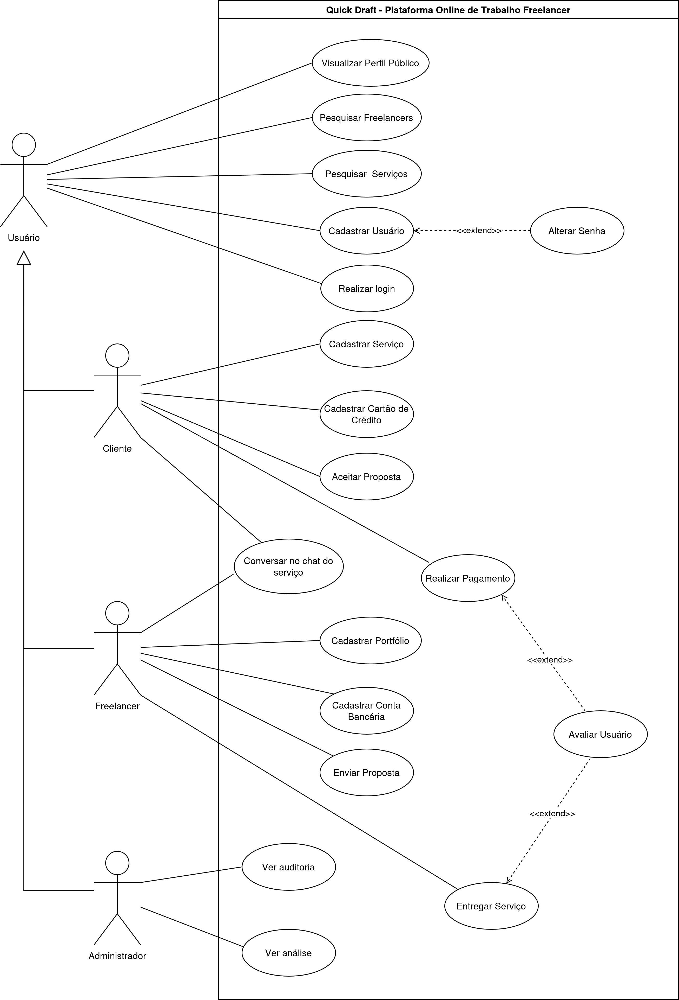

### Modelagem das classes

Para modelar as classes do sistema, foi usado o site [Mermaid Live Editor](https://mermaid.live/).

Documentação da parte de diagramas de classe: [Docs Class Diagram](https://mermaid.js.org/syntax/classDiagram.html)

### Modelo Relacional

Para criar o modelo relacional do sistema, foi usado o site [drawDB](https://www.drawdb.app/editor).

### Use Case

Para criar o modelo de casos de uso, foi usado o [draw.io](https://www.drawio.com/);

